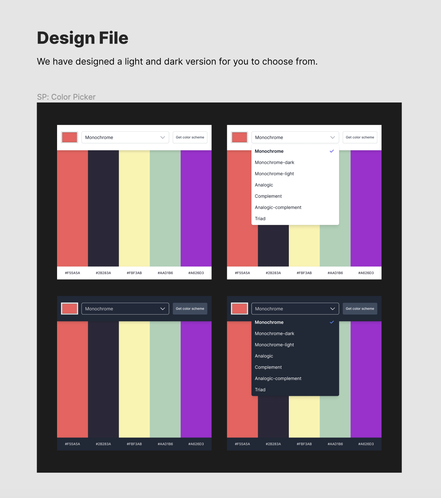

# Color Scheme Generator

## Table of contents

- [Overview](#overview)
  - [Requirements](#requirements)
  - [Screenshots](#screenshots)
- [Project walkthrough](#project-walkthrough)
 
## Overview

### Requirements

- [x] Choose "seed color" with an \<input type="color" />
- [x] Choose color scheme mode in a \<select> box
- [x] Clicking button makes request to [The Color API](https://www.thecolorapi.com/) to get a color scheme
- [x] Display the scheme colors and hex values on the page
- [x] Stretch goal: click hex values to copy to clipboard

### Screenshots

## Project walkthrough

1.Select a color.
2.Select a scheme type.
3.Click on "Get Color Scheme".

A solo project from the Scrimba.
